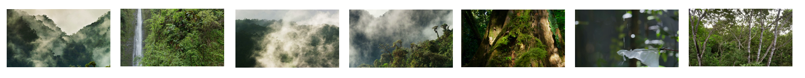
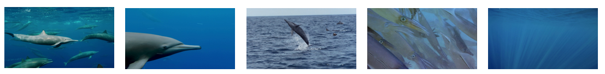

# RATV Demo

Here is the demo of the paper Shot Retrieval and Assembly with Text Script for Video Montage Generation. We provide two video montages generated by our proposed RATV here. Please click the link to watch the video.

**[Video 1](https://youtu.be/o6jFBBMmJ9c)**

*``Jungles are the richest places on Earth, because of one remarkable fact, they make their own weather. Every day, water rises from the surface of the leaves as vapour.''*  

**[Video 2](https://youtu.be/ajRGEVL4M3o)**

*``Spinners are the most vocal of all the dolphins. They use echolocation, a kind of sonar, to find their prey. Each hunter sends out a series of clicks, and then listens for returning echoes, allowing them to scan for distant prey, hundreds of metres away.''*  

# VSPD Dataset

We release our constructed VSPD dataset, which contains 4365 script-video pairs that consist of 19613 shots in total. All shots and annotation files can be downloaded from the anoymous [google driver](https://drive.google.com/drive/folders/1VFtgqw8QivFwUHx5E4vawIj7vW3oH0As?usp=sharing). All released shot videos are resized to 480 \* 270, which has no influence on the training and generation.

